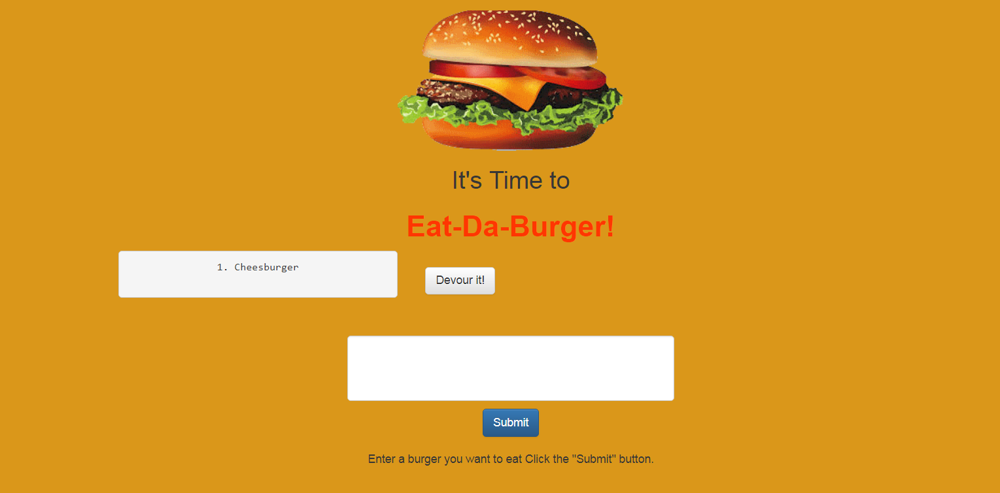
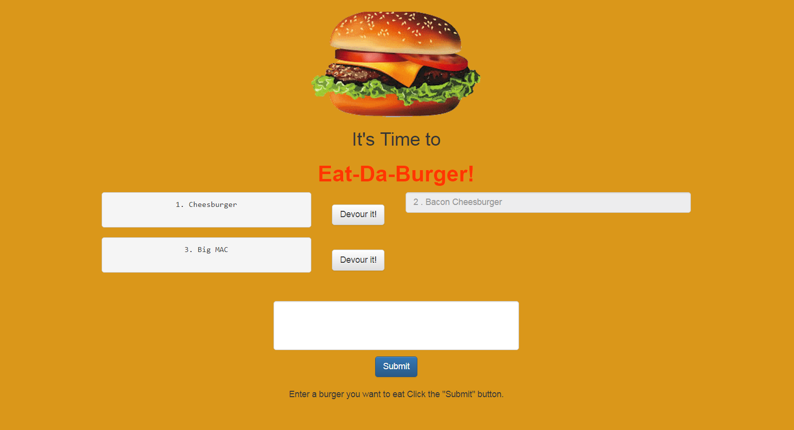

# Eat-Da-Burgers
*A restaurant app that lets users input the names of burgers they'd like to eat..* *Try it HERE!===>* [Eat-Da-Burger](https://obscure-atoll-68039.herokuapp.com)

----------

## Overview

Eat-Da-Burger! is a restaurant app that lets users input the names of the burgers that they would like to eat. Whenever a user submits a burger's name into the input field the application will display the burger on the left hand side of the page -- waiting to be devoured. Each burger in the waiting area also has a "Devour it!" button associated with it. When the user clicks the "Devour it!" button the burger will move to the right side of the page. This app will store every burger in a database , whether devoured or not...Go ahead and give it a try!.

## Figure 1. The input page

- **This image depicts the home page before a burger is added**

## Figure 2. The input page with a burger added

- **This image depicts the home page with a burger added**

## Figure 3. The Results Burgers added and Devoured

- **This image depicts the home page with added burgers and devoured burgers**

## Technology used on this project

- **JavaScript**, **J-Query**
- **HTML**, **CSS**,**Bootstrap**
- **Node.js**, **Express-Node Package**, **Body-Parser-Node Package**, **Path-Node Package**, **fs-Node Package**, **sequelize-Node Package**
- **ORM**
- **GitHub**
- **Heroku**
- **mySql**

----------

## Author

**Joe McCreesh**